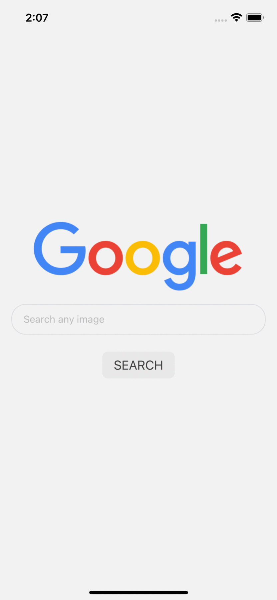

# GoogleCustomSearch:
A react native mobile app to fetch data from google custom search api and display the results


## Objective:
A simple 3 screen app to fetch images from Google and display them in a list.

  Screen 1: Search Screen. Type in the search field for image query
  Screen 2: The search results of the previous screen displayed in this list format. The results are displayed as images with some metadata
  Screen 3: On clicking any of these images on the previous screen, more details of the image are shown here.

## API used:
```bash
  curl -X GET \'https://www.googleapis.com/customsearch/v1?q=harrypotter&cx=011476162607576381860:ra4vmliv9ti&key=<API KEY>' \
    -H 'Content-Type: application/json' \ 
    -H 'cache-control: no-cache’
```
  
  Sample JSON Response: [find here](https://pastebin.com/6CqcVDZP)
  
## Note:
  Please get your own API key from a separate Google project.

## Screenshots:


